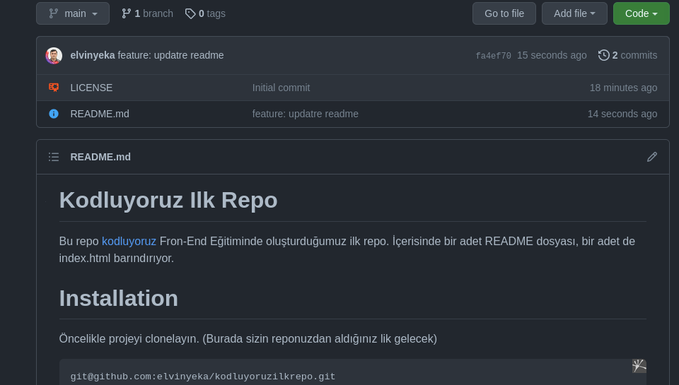

# Kodluyoruz Ilk Repo

Bu repo [kodluyoruz](https://kodluyoruz.org/tr/kodluyoruz/) Fron-End Eğitiminde oluşturduğumuz ilk repo. İçerisinde bir adet README dosyası, bir adet de index.html barındırıyor.



# Installation

Öncelikle projeyi clonelayın. (Burada sizin reponuzdan aldığınız lik gelecek)

```
git@github.com:elvinyeka/kodluyoruzilkrepo.git

```

# Usage

Projeyi cloneladıktan sonra Visual Studio Code programinda açınız.

Linux için:

```
cd kodluyouzilkrepo
code .

```

# Contributing

Pull requestler kabul edilir. Büyük deyişikler için, lütfen önce neyi deyiştirmek istediğinizi tartışmak için bir konu açınız.

# License

[MIT](https://choosealicense.com/licenses/mit/)
